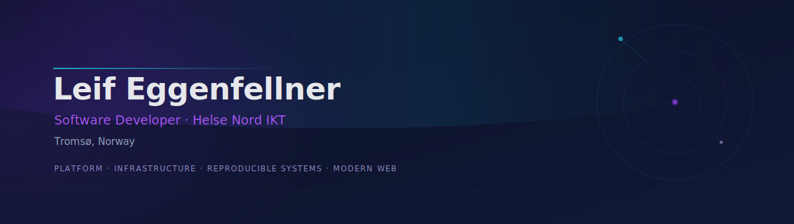

Systems-minded software developer based in **Tromsø, Norway**. I build across the full stack with a strong pull toward infrastructure, platform engineering, and reproducible systems. My background spans healthcare ICT, satellite communications, and transport — alongside 2.5 years of DevOps engineering and technical leadership at Orbit NTNU, a student satellite organisation at NTNU Trondheim.

---

## Engineering Focus

<table>
<tr>
<td valign="top" width="50%">

<strong>Platform &amp; Infrastructure</strong>  
DevOps pipelines, infrastructure automation, NixOS, and reproducible system design.  
<code>NixOS</code> <code>Docker</code> <code>CI/CD</code> <code>IaC</code>

</td>
<td valign="top" width="50%">

<strong>Full-Stack Systems</strong>  
Web services, APIs, and data pipelines from frontend to backend.  
<code>TypeScript</code> <code>Vue</code> <code>Scala</code> <code>PostgreSQL</code>

</td>
</tr>
<tr>
<td valign="top" width="50%">

<strong>Architecture &amp; Reliability</strong>  
System design with an emphasis on maintainability, clear service boundaries, and distributed patterns.  
<code>Microservices</code> <code>REST</code> <code>Event-driven</code>

</td>
<td valign="top" width="50%">

<strong>Modern Web</strong>  
Frontend across multiple frameworks, with a preference for Tailwind CSS and component-driven architecture.  
<code>Vue</code> <code>React</code> <code>Svelte</code> <code>Tailwind CSS</code>

</td>
</tr>
</table>

---

## Experience

**Software Developer — Helse Nord IKT** _(current)_

**Professional contexts:** Helse Nord IKT · KSAT · Torghatten · HEMIT

---

### Orbit NTNU · 2.5 years

_Student satellite organisation, NTNU Trondheim_

| Role                   | Focus                                            |
| :--------------------- | :----------------------------------------------- |
| DevOps & Web Team Lead | Combined DevOps and Web engineering leadership   |
| DevOps Team Lead       | Led the DevOps engineering team                  |
| DevOps Engineer        | Build, deployment, and operations infrastructure |
| SatCom Team Member     | Satellite communications _(final semester)_      |

---

**Bachelor in Informatics** — NTNU, Trondheim

---

## Stack

|                        | Technologies                                                                                       |
| :--------------------- | :------------------------------------------------------------------------------------------------- |
| **Day-to-day**         | TypeScript · Vue · Scala · PostgreSQL · GitHub Actions · NixOS · Docker                            |
| **Strong foundations** | Python · React · JavaScript · CSS · Tailwind CSS · SQL                                             |
| **Currently building** | Svelte · Astro _(personal portfolio)_                                                              |
| **Explored**           | Rust · C++ · Bash                                                                                  |
| **Interests**          | Platform Engineering · DevOps · Software Architecture · Reproducible Systems · Distributed Systems |

---

## GitHub Signal

> Public GitHub data is a partial view — most professional contributions live in private or organisation repositories.

  
  

---

## Connect

[LinkedIn](https://www.linkedin.com/in/leif-eggenfellner/)
